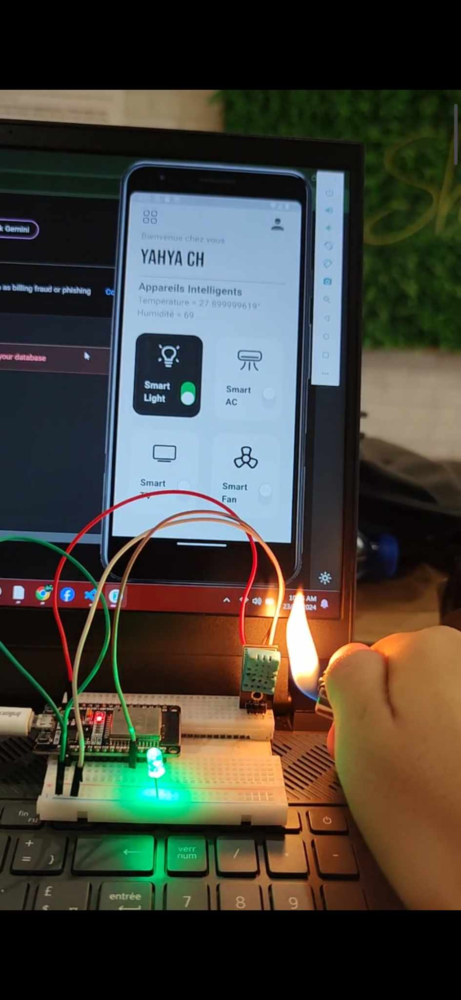
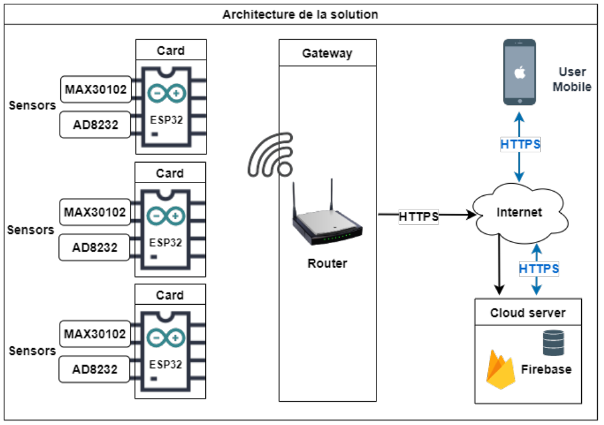
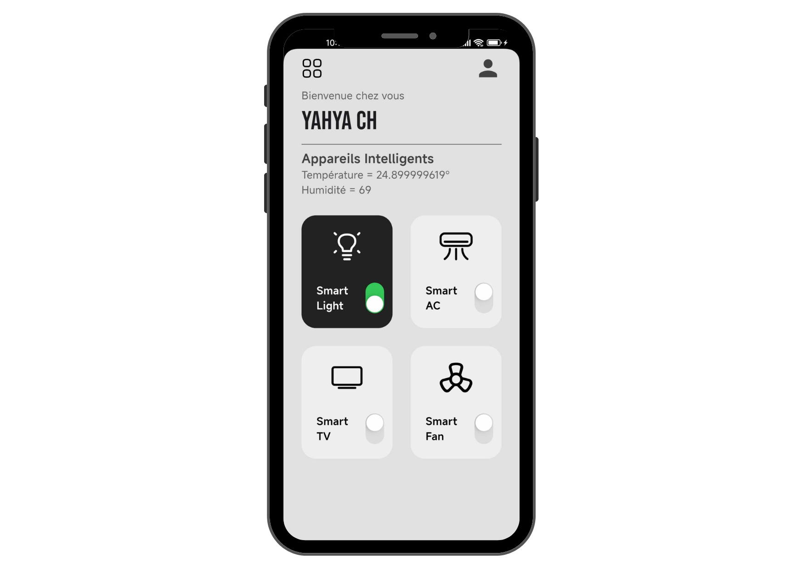

# Smart Home IoT System for Environmental Monitoring and LED Control


## Description

This project is a smart home IoT solution that monitors environmental conditions and enables remote control of devices using the  **ESP32 board, Firebase,** and **Flutter**.  The system reads temperature and humidity values from a **DHT11 sensor** and sends the data to **Firebase**, where it can be accessed and visualized in real-time on a **Flutter mobile application**. Additionally, the app allows users to remotely control an LED connected to the ESP32 through Firebase.

## System Architecture

Below are diagrams illustrating the architecture of the Smart Home IoT System:

### Overall System Architecture




These diagrams showcase how system components interact, from the ESP32 sending DHT11 sensor data to Firebase, to the Flutter app displaying data and enabling device control.

## Features

- **Real-Time Data Display**: Continuous monitoring of temperature and humidity data on the Flutter app.
- **Remote LED Control**: The mobile app can control an LED connected to the ESP32, allowing users to turn it on or off from anywhere.
- **Firebase Integration**: Real-time data storage and updates using Firebase.
- **Mobile App Integration**: Users can visualize sensor data and control connected devices from their mobile phones.

## Screenshot




## Tech Stack

- **Flutter**: For building the cross-platform mobile application.
- **Firebase**: Used for real-time data storage and device control.
- **ESP32**: For collecting sensor data and managing device control.
- **Sensors**: 
  - **DHT11**: For monitoring temperature and humidity.
 
## How to Run

### Hardware Setup:
1. Connect the DHT11 sensor and an LED to the ESP32 board.
2. Program the ESP32 to read the DHT11 sensor data and communicate with Firebase for data transmission and LED control.
3. Ensure the ESP32 is connected to a wireless network.

### Mobile App Setup:
1. Clone the repository:
   ```bash
   git clone https://github.com/ChebbiYahya/smart_home.git

2. Navigate to the project directory
    ```bash
    cd smart_home

3. Install dependencies:
    ```bash
    flutter pub get

4. Run the app:
    ```bash
    flutter run